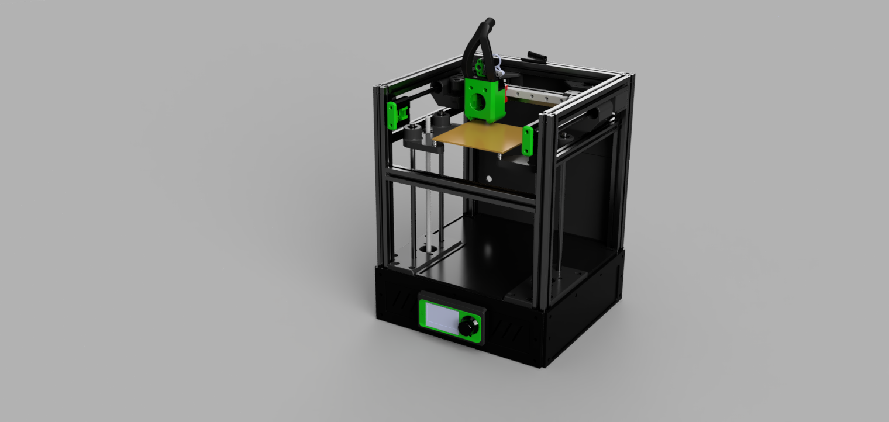

# The RIFF120 DIY 3D printer

>[!NOTE]
>This is just a heads up about the next project.

## Some tentative information about the design and build:

- Max printable area 120x120x170/240, (X restricted by toolhead width)
- 2020 extrusions 
- Orange Pi Zero SBC (use any SBC with 3-4 USB ports)
- Controller card(s) with a total of 5 stepper drivers
- MGN 12H rails/carriage X
- 10mm rods and bearings on Y 
- 8mm rods and bearings on Z 
- Corexy
- Klipper firmware 
- Dual z steppermotors (z-tilt functionality)
- Sensorless homing on X and Y 
- Dragonburner with Sherpa micro
- Low budget CPAP solution with 2 x 5015 fans 
- 1 x 120W 24V power supply (heat bed is 12V)
- 1 x 250W 12V and 5V power supply (HP server PSU)
- Chamber heater

### Cutting extrusions

- 4x2020 380mm or 450mm for Z 
- 4x2020 245mm for y
- 4x2020 260mm for X
- 1x2020 209mm for X axis MGN rail
- 2x2020 (or 1515) 235mm for y rodsupport 

>[!TIP]
>Check the frame for squareness and adjust/correct  as needed.
>Mount the 2 z-motor mounts with M5 10mm bolts. The motor mounts makes the frame more rigid. Check the frame again for squareness.
