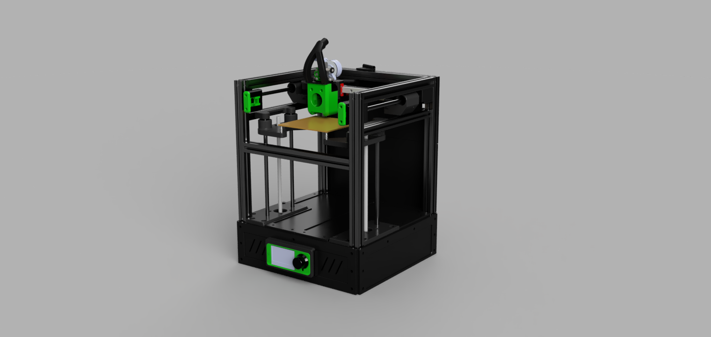
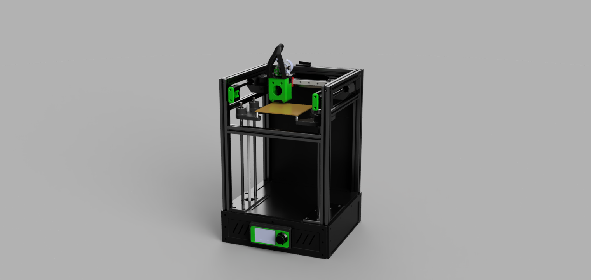
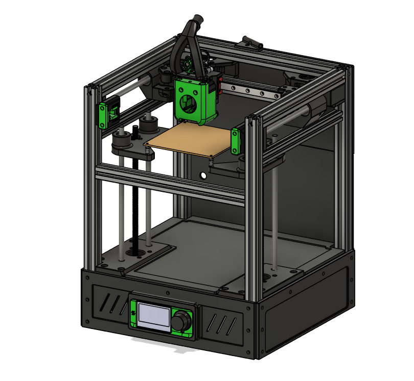

# The RIFF120 DIY 3D printer medium and tall version

>[!NOTE]
>This is just a heads up about the next build.

## About the design and build:

- Max printable area 120x120x170 or 240mm, (X restricted by toolhead width)
- 2020 extrusions 
- Orange Pi Zero SBC (use any SBC with 3-4 USB ports)
- Controller card with a total of 4 stepper drivers
- MGN 12H rails/carriage X
- 10mm rods and bearings on Y 
- 8mm rods and bearings on Z 
- Corexy
- Klipper firmware 
- Dual z steppermotors
- Sensorless homing on X and Y 
- Dragonburner with Sherpa micro
- Low budget CPAP solution with 2 x 5015 fans 
- 1 x 100W 24V power supply
- 1 x HP server PSU 12V and 5V (heat bed + heater)
- Chamber heater 12V and 70W

### Cutting extrusions, tentative!

- 4x2020 380mm (or 450mm for tall version) for Z 
- 4x2020 245mm for Y
- 4x2020 260mm for X
- 1x2020 209mm for X axis MGN rail
- 2x2020 (or 1515) 245mm for y rodsupport 

>[!TIP]
>Check the frame for squareness and adjust/correct  as needed.
>Mount the 2 z-motor mounts with M5 10mm bolts. The motor mounts makes the frame more rigid. Check the frame again for squareness.

# Credits/sources for remixes
https://github.com/VoronDesign/Voron-Trident
https://github.com/clee/VoronBFI
https://github.com/chirpy2605/voron/tree/main/V0/Dragon_Burner
